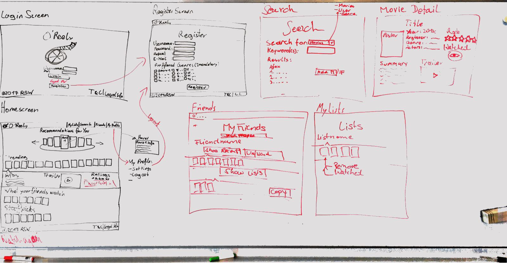

Projectname: O’Reely

Teammembers:
- Markus Wolf
- Lukas Schneider
- Felix Rauchenwald

Description:
Our project is a social network, where users can create lists of movies they have seen or plan to watch and share them with others.
It will feature the following pages:
* Login / Register
   * Here can users create an account for our web application or log in with an existing one.
* Homescreen
   * The user control center after the login, where users can add,edit,view delete their lists. Based on the “Watched” list, recommendations what to watch next are displayed Recent activities from befriended users are shown as a feed. 
   * Users can search for other users and befriend them to view their lists.
* Edit profile
   * Users can change their profile settings (Username, password, favorite genres, filters)
* List-Page
    * Movie-Detail-Page: Information about the movie is displayed (Title, cover, metainfo, description) and options to add them to a list and to rate and recommend it.
    * Administration Page: Manage all user accounts, Edit database entries, logs,

Basic Design of the Frontend:

Cost estimation:

For the costs we are calculating a payment of 20€ per hour per person, because we think this is a
realistic value based on previous experiences and considering that a hour of a programmer at an
IT-companycosts about 80-100€, so all 4 of us togehter should be worth at least as much.

The baselayout for our calculations was this  [Application Development Project Work Breakdown Structure](http://www.theprojectdiva.com/application-development-project-work-breakdown-structure/)

* 1.1. Application Development Project Management (4h)
    * 1.1.2. Resource Management Plan 2h
    * 1.1.3. Scope Development 0.5h
    * 1.1.6. Budget 0.5h
    * 1.1.7. Scheduling 0.5h
    * 1.1.8. Document Change Control Processes 0.5h
* 1.2. Application Architecture (22h)
    * 1.2.1. Functional Specifications
        * 1.2.1.1. Process Models 10h
        * 1.2.1.2. User Interface 8h
        * 1.2.1.3. Database Model 4h
* 1.3. Application Development (88h)
    * 1.3.1. Setup Development Environment 8h
    * 1.3.2. UI Development 30h
    * 1.3.3. Code Development 50h
* 1.4. Application Testing (20h)
    * 1.4.1. Test Environment Setup 4h
    * 1.4.2. Unit Testing 10h
    * 1.4.3. Results Reporting 6h
* 1.5. Application Deployment  (8h)
    * 1.5.1. Documentation
        * 1.5.1.1. End User Documentation 8h

Alltogether: 142h
Costs 142h * 20€/h = 2840€
Considering that there might be unexpected problems our proposal would be 3000€ for the whole project.
